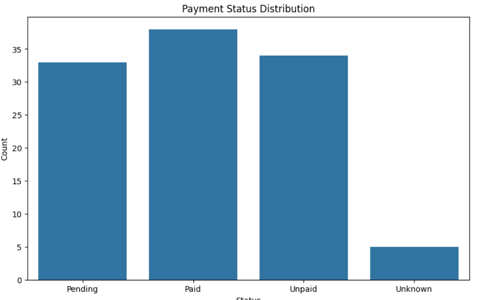

# Healthcare Billing Data Analysis

The Healthcare Billing Data Analysis project provides a comprehensive solution for managing, validating, analyzing, and generating detailed reports for billing data in the healthcare industry, specifically within the pharmacy sector. Leveraging Python and AI tools, this project ensures data accuracy and produces insightful visualizations and reports.

## Table of Contents

- [Features](#features)
- [Requirements](#requirements)
- [Usage](#usage)
  - [Data Collection and Cleaning](#data-collection-and-cleaning)
  - [Data Validation](#data-validation)
  - [Billing Analysis](#billing-analysis)
  - [Report Generation Using AI](#report-generation-using-ai)

## Features

- **Data Collection**: Load and clean account and billing data from various sources.
- **Data Validation**: Ensure accuracy and completeness of billing data.
- **Billing Analysis**: Identify discrepancies, analyze billing cycles, and evaluate payment patterns.
- **Report Generation**: Utilize AI to generate comprehensive billing reports with visualizations and insights.
- **Automation**: Automate the entire pipeline from data collection to report generation.

## Requirements

- Python 3.6 or higher
- NumPy
- Pandas
- Matplotlib
- Seaborn
- Requests

Ensure your dataset includes columns such as `account_id`, `customer_name`, `billing_date`, `amount`, `status`, `description`, and `department` and is in CSV format.

### Jupyter Notebook

To run the analysis and generate reports, open the Jupyter Notebook `main.ipynb`

### Plottings Generated are given below

 

